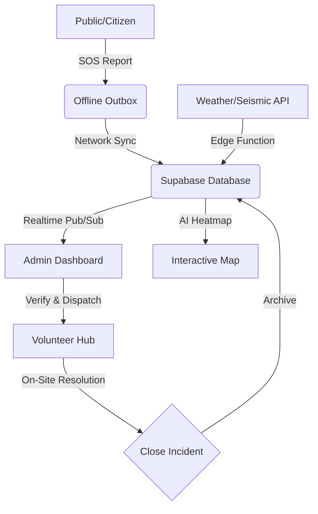

# ResQ AI: Disaster Management & Coordination Platform 🚒🚨

ResQ AI is a grid-resilient, AI-powered emergency response coordination platform designed to save lives in disaster-prone regions like India. It combines real-time data ingestion, predictive modeling, and decentralized volunteer coordination.


## 🚀 Key Features

### 📡 Real-Time Monitoring
- **Live Ingestion**: USGS Earthquake data and global weather alerts polled every 5 minutes via Supabase Edge Functions.
- **Interactive Map**: Pulse markers for live incidents with severity-based clustering.
- **Safe Zone Geofencing**: Automatically find nearby hospitals, shelters, and relief camps.

### 🚨 SOS & Emergency Logic
- **Critical SOS**: Sub-second signaling to all active admins and nearby volunteers.
- **Admin Command Center**: Real-time incident verification, prioritization, and resolution workflow.

### 🤖 AI Prediction (MVP)
- **Risk Heatmaps**: Visualizes pulsing danger zones based on meteorological trends (e.g., predicted flash floods or seismic risk).

### 📵 Grid-Resilient Architecture
- **Offline Outbox**: Reports are saved to IndexedDB when the network is cut and synced automatically when back online.
- **PWA Ready**: Install as a native mobile app for critical offline access.
- **Low-Bandwidth Mode**: Automatically detects slow networks (2G/3G) and optimizes data transfer.

---

## 🛠️ Tech Stack

- **Frontend**: Vite + React + Tailwind + Lucide Icons
- **Maps**: Leaflet + OpenStreetMap + PostGIS
- **Backend/Auth**: Supabase (Auth, Storage, Realtime, Edge Functions)
- **Offline Logic**: Service Workers (Workbox) + IndexedDB (IDB)
- **Infrastructure**: Vercel (CI/CD)

---

## 💻 Running Locally

### Prerequisites
- Node.js (v18+)
- Supabase CLI
- A Supabase Project (for DB & Edge Functions)

### 1. Clone & Install
```bash
git clone <your-repo-url>
cd resq-ai
npm install
```

### 2. Environment Variables
Create a `.env` file in the root:
```env
VITE_SUPABASE_URL=your_supabase_url
VITE_SUPABASE_ANON_KEY=your_supabase_anon_key
```

### 3. Database Migration
Deploy the schema to your Supabase instance:
```bash
supabase db push
```

### 4. Start Development
```bash
npm run dev
```

### 5. Build for Production (with PWA)
```bash
npm run build
```

---

## 🏛️ Project Structure

```text
resq-ai/
├── .planning/           # Phase-by-phase R&D documentation
├── supabase/
│   ├── functions/       # Data ingestion & notification edge functions
│   └── migrations/      # PostGIS schema & RLS policies
├── src/
│   ├── components/      # UI components (atoms, layout, map, reports)
│   ├── hooks/           # Custom auth, connection & SOS hooks
│   ├── lib/             # Supabase client & Offline outbox
│   ├── pages/           # Page containers (Home, Map, Admin, Volunteer)
│   └── store/           # Zustand state management
└── vite.config.ts       # PWA & Build configuration
```

---

## 🤝 Contributing

1. **Check the Roadmap**: Refer to `.planning/ROADMAP.md` for upcoming features.
2. **Issue Tracker**: Review `.planning/STATE.md` for pending tasks.
3. **Draft Plans**: Always create a `PLAN.md` before significant feature additions.

---

## 📄 License
MIT License - Developed by Antigravity AI & Team.

---
---

## 🗺️ App Sitemap & Navigation

| Page | Description | Key Components |
| :--- | :--- | :--- |
| **🏠 Home** | High-impact landing page & main entry | Hero Section, Global Stats, SOS CTA |
| **🗺️ Map (Command)** | Real-time incident monitoring & AI heatmaps | Leaflet Map, Filter Sidebar, Pulse Markers |
| **🛡️ Volunteer Hub** | Task management & local alerts for responders | Task List, Distance Indicators, Skill Badges |
| **📊 Admin Dashboard** | Mission control for incident verification | Ticket Escalation, Resource Allocation, Logs |
| **🚨 SOS Report** | Rapid, offline-first incident filing | Smart Form, Media Upload, Geolocation |
| **👤 Profile Setup** | User onboarding & certification tracking | Multi-step form, Skills selector |
| **🔐 Auth** | Secure access & role-base redirection | Magic Link / Email Provider |

---

## ✨ UI/UX & Visual Identity

ResQ AI is designed to feel like a modern, mission-critical command center.

### 🌌 The Hero Section (Home Page)
- **Visual Foundation**: A high-fidelity, 3D pulsing globe (Web-GL) or a grid-mesh background representing the "Human Safety Network".
- **Glassmorphism**: All UI elements are built on `backdrop-blur-xl` surfaces with subtle `border-white/10` edges, ensuring visibility over complex map data.
- **Micro-interactions**: Every button and card uses high-contrast hover lifts and glowing shadows to guide the user's eye.

### 🎬 Animations & Motion
- **Page Transitions**: Smooth slide-up and fade-in effects using **Framer Motion** to reduce cognitive load during high-stress scenarios.
- **Pulse Indicators**: Critical incidents use a triple-ring SVG animation to represent urgency.
- **Data Streaming**: Real-time status updates use subtle "shimmer" effects when new data arrives from Supabase.

---

## 🔗 System Interconnectivity

ResQ AI uses a **"Rescue Lifecycle"** data flow to ensure sub-second response times:



1. **Ingestion**: Global APIs and Citizien Reports feed the central Supabase engine.
2. **Offline Resilience**: All pages use a local storage buffer, ensuring navigation works even when the 4G/5G grid is down.
3. **Realtime Handshaking**: Admins and Volunteers are connected via WebSocket, ensuring zero-latency coordination.

---

**ResQ AI: When seconds matter, data saves lives.**
