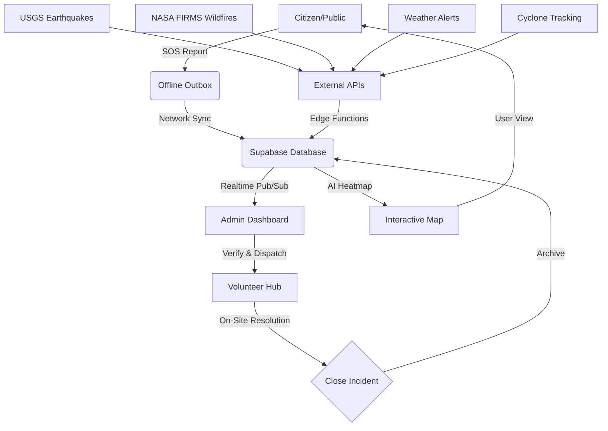

# ResQ AI: Disaster Management & Coordination Platform 🚒🚨

ResQ AI is a grid-resilient, AI-powered emergency response coordination platform designed to save lives in disaster-prone regions like India. It combines real-time data ingestion, predictive modeling, and decentralized volunteer coordination with a premium cinematic user experience.


## 🚀 Key Features

### 🎬 Premium Cinematic Loader
- **9-Second Animated Experience**: Elegant loader featuring India map with scanning animations
- **Real-time System Messages**: Dynamic loading text showing system initialization
- **Smooth Transitions**: Fade-out to fade-in transition to home page
- **Playfair Display Typography**: Elegant serif font for premium branding
- **Interactive**: Click anywhere to skip and jump directly to the app

### 📡 Real-Time Monitoring
- **Live Ingestion**: USGS Earthquake data, NASA FIRMS wildfire data, and global weather alerts polled every 5 minutes via Supabase Edge Functions
- **Interactive Map**: Pulse markers for live incidents with severity-based clustering
- **Safe Zone Geofencing**: Automatically find nearby hospitals, shelters, and relief camps
- **14 Major Indian Cities**: Accurate state/city nodes with real-time coordination

### 🚨 SOS & Emergency Logic
- **Critical SOS**: Sub-second signaling to all active admins and nearby volunteers
- **Admin Command Center**: Real-time incident verification, prioritization, and resolution workflow
- **Floating SOS Button**: Always accessible emergency reporting from any page

### 🤖 AI Prediction (MVP)
- **Risk Heatmaps**: Visualizes pulsing danger zones based on meteorological trends (e.g., predicted flash floods or seismic risk)
- **Multi-source Data Integration**: USGS earthquakes, weather alerts, cyclone tracking, and wildfire monitoring

### 📵 Grid-Resilient Architecture
- **Offline Outbox**: Reports are saved to IndexedDB when the network is cut and synced automatically when back online
- **PWA Ready**: Install as a native mobile app for critical offline access
- **Low-Bandwidth Mode**: Automatically detects slow networks (2G/3G) and optimizes data transfer
- **Offline Banner**: Visual indicator when running in resilient mode

### 🌐 Internationalization (i18n)
- **Multi-language Support**: English, Hindi, Bengali, and Hinglish
- **Automatic Translation**: Python-based translation scripts for easy localization
- **Cultural Adaptation**: Region-specific messaging and terminology

---

## 🛠️ Tech Stack

- **Frontend**: Vite + React 18 + TypeScript + Tailwind CSS
- **UI Components**: Framer Motion (animations) + Lucide Icons
- **Maps**: Leaflet + OpenStreetMap + PostGIS
- **Backend/Auth**: Supabase (Auth, Storage, Realtime, Edge Functions)
- **Offline Logic**: Service Workers (Workbox) + IndexedDB (IDB)
- **State Management**: Zustand
- **Infrastructure**: Vercel (CI/CD)
- **Fonts**: Playfair Display, DM Sans, Inter, JetBrains Mono

---

## 💻 Running Locally

### Prerequisites
- Node.js (v18+)
- npm or yarn
- Supabase CLI (optional, for local development)
- A Supabase Project (for DB & Edge Functions)

### 1. Clone & Install
```bash
git clone <your-repo-url>
cd resq-ai
npm install
```

### 2. Environment Variables
Create a `.env.local` file in the root:
```env
VITE_SUPABASE_URL=your_supabase_url
VITE_SUPABASE_ANON_KEY=your_supabase_anon_key
VITE_OPENWEATHER_API_KEY=your_openweather_key
VITE_NASA_FIRMS_API_KEY=your_nasa_firms_key
```

### 3. Database Migration
Deploy the schema to your Supabase instance:
```bash
supabase db push
```

Or manually run the SQL files in `.planning/phases/01-foundation-supabase-infrastructure-setup/`

### 4. Start Development
```bash
npm run dev
```

The app will be available at `http://localhost:5173`

### 5. Build for Production (with PWA)
```bash
npm run build
npm run preview  # Preview production build
```

### 6. Translation Scripts (Optional)
```bash
cd scripts
pip install -r requirements.txt
python run_translation.py
```

---

## 🏛️ Project Structure

```text
resq-ai/
├── .planning/              # Phase-by-phase R&D documentation
│   ├── phases/            # Detailed implementation plans
│   ├── research/          # Architecture & stack decisions
│   └── ROADMAP.md         # Development roadmap
├── Backend/
│   ├── controllers/       # API controllers
│   ├── services/          # Data ingestion services
│   └── utils/             # Geocoding & utilities
├── supabase/
│   ├── functions/         # Edge functions for data ingestion
│   └── migrations/        # PostGIS schema & RLS policies
├── src/
│   ├── components/        # UI components
│   │   ├── ui/           # Reusable UI elements
│   │   ├── layout/       # Layout components
│   │   └── CinematicLoader.tsx  # Premium loader
│   ├── hooks/            # Custom React hooks
│   ├── lib/              # Supabase client & utilities
│   ├── pages/            # Page components
│   ├── store/            # Zustand state management
│   ├── mapLoader/        # Map assets (India map PNG)
│   └── App.tsx           # Main app component
├── public/
│   ├── locales/          # i18n translation files
│   └── manifest.json     # PWA manifest
├── scripts/              # Translation automation
└── vite.config.ts        # PWA & Build configuration
```

---

## 🎨 Design System

### Color Palette
- **Primary**: Green (`#10B981`) - Safety, activation, success
- **Danger**: Red (`#EF4444`) - Alerts, scanning, critical incidents
- **Background**: Dark (`#0A0A0A`) - Premium, focused interface
- **Text**: White with opacity variants for hierarchy

### Typography
- **Headings**: Playfair Display (serif, elegant, italic)
- **Body**: DM Sans (clean, readable)
- **Monospace**: JetBrains Mono (technical data, codes)
- **UI**: Inter (modern, neutral)

### Animation Principles
- **Smooth Easing**: Custom cubic-bezier curves for natural motion
- **Staggered Timing**: Sequential animations for visual hierarchy
- **Performance**: GPU-accelerated transforms (translate, scale, opacity)
- **Accessibility**: Respects `prefers-reduced-motion`

---

## 🤝 Contributing

1. **Check the Roadmap**: Refer to `.planning/ROADMAP.md` for upcoming features
2. **Issue Tracker**: Review `.planning/STATE.md` for pending tasks
3. **Draft Plans**: Always create a `PLAN.md` before significant feature additions
4. **Code Style**: Follow existing patterns, use TypeScript, add comments for complex logic
5. **Testing**: Test on multiple screen sizes and network conditions

---

## 📄 License
MIT License - Developed with ❤️ for saving lives

---

## 🗺️ App Sitemap & Navigation

| Page | Route | Description | Key Features |
| :--- | :--- | :--- | :--- |
| **🎬 Loader** | `/` (initial) | Cinematic 9s intro | India map animation, system messages |
| **🏠 Home** | `/` | Landing & dashboard | Hero section, stats, quick actions |
| **🗺️ Map** | `/map` | Real-time incident monitoring | Leaflet map, filters, live markers |
| **🛡️ Volunteer** | `/volunteer` | Task management for responders | Task list, distance, skill matching |
| **📊 Admin** | `/admin` | Mission control dashboard | Incident verification, resource allocation |
| **🚨 SOS** | `/sos` | Rapid incident reporting | Offline-first form, geolocation, media upload |
| **👤 Profile** | `/profile` | User settings & preferences | Notifications, language, theme |
| **🔐 Auth** | `/auth` | Authentication | Email/password, magic link |
| **✅ Onboarding** | `/volunteer-onboarding` | Volunteer registration | Multi-step form, skills, location |

---

## ✨ UI/UX & Visual Identity

ResQ AI is designed to feel like a modern, mission-critical command center with cinematic polish.

### 🎬 The Cinematic Loader
- **India Map Visualization**: Accurate PNG with state-level detail
- **Dual Scanning System**: Red scan (threat detection) → Green scan (system activation)
- **14 City Nodes**: Major Indian cities with pulsing indicators
- **Dynamic Messages**: 5 rotating system initialization messages
- **Premium Typography**: Playfair Display italic for elegant branding
- **Smooth Transitions**: 0.8s fade-in to home page

### 🌌 The Hero Section (Home Page)
- **Visual Foundation**: High-fidelity background with grid patterns
- **Glassmorphism**: Backdrop-blur surfaces with subtle borders
- **Micro-interactions**: Hover lifts and glowing shadows
- **Responsive Design**: Adapts seamlessly from mobile to desktop

### 🎬 Animations & Motion
- **Page Transitions**: Smooth slide-up and fade-in (Framer Motion)
- **Pulse Indicators**: Triple-ring SVG for critical incidents
- **Data Streaming**: Shimmer effects for real-time updates
- **Loading States**: Skeleton screens and progress indicators

---

## 🔗 System Interconnectivity

ResQ AI uses a **"Rescue Lifecycle"** data flow:



### Data Flow
1. **Ingestion**: Multiple data sources feed Supabase via Edge Functions
2. **Offline Resilience**: IndexedDB buffer ensures functionality without network
3. **Realtime Coordination**: WebSocket connections for zero-latency updates
4. **AI Processing**: Risk analysis and predictive heatmaps
5. **User Interface**: Smooth, responsive UI with premium animations

---

## 🚀 Performance Optimizations

- **Code Splitting**: Route-based lazy loading
- **Image Optimization**: WebP format, lazy loading, responsive images
- **Bundle Size**: Tree-shaking, minification, compression
- **Caching**: Service Worker caching strategies
- **Network Detection**: Adaptive loading based on connection speed
- **Animation Performance**: GPU-accelerated, 60fps target

---

## 🔒 Security Features

- **Row Level Security (RLS)**: Supabase policies for data access
- **Authentication**: Secure email/password and magic link
- **Role-Based Access**: Admin, volunteer, and citizen roles
- **Data Encryption**: HTTPS, encrypted storage
- **Input Validation**: Client and server-side validation
- **Rate Limiting**: API throttling for abuse prevention

---

## 📱 PWA Features

- **Installable**: Add to home screen on mobile/desktop
- **Offline Support**: Core functionality works without internet
- **Push Notifications**: Critical alerts even when app is closed
- **Background Sync**: Automatic data synchronization
- **App-like Experience**: Full-screen, native feel

---

**ResQ AI: When seconds matter, data saves lives.**

*Protecting Lives. Powered by Intelligence.*
